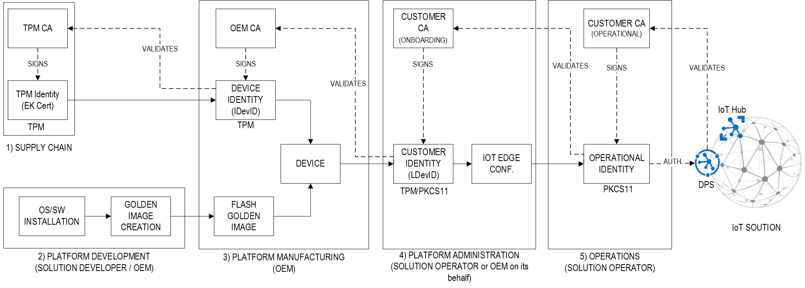
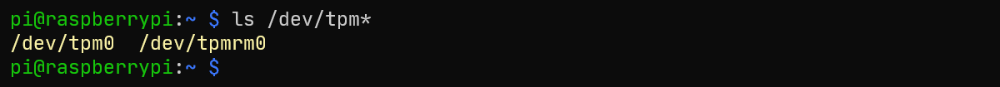
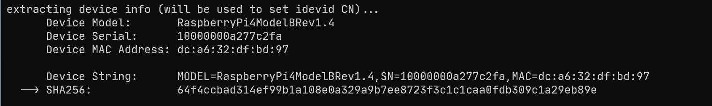
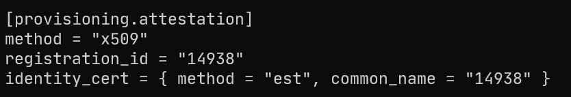
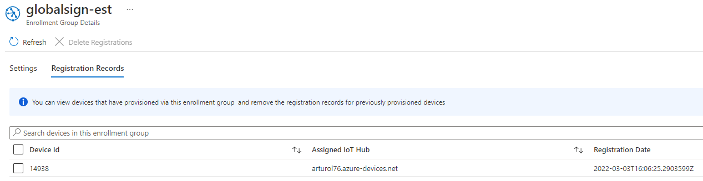

# iotedge-tpm2cloud
This repo provides documentation and  scripts to help implement a the zero-touch provisioning at scale of Azure IoT Edge devices based on [this](https://azure.microsoft.com/en-us/blog/the-blueprint-to-securely-solve-the-elusive-zerotouch-provisioning-of-iot-devices-at-scale/) blueprint, with strong identities securely stored in a TPM2 HSM via the PKCS#11 interface and x509 certificates issued over EST from a public CA such as GlobalSign. 



## Getting Started
Grab the scripts from this repo:
```bash
git clone https://github.com/Azure-Samples/iotedge-tpm2cloud
cd iotedge-tpm2cloud/scripts-provisioning
```

You have two options:
* either go through the individual steps described in the next sections...
* ...or jump to [this](./README.md#an-example-single-click-tpm2cloud-provisioning-of-a-raspberry-pi-34) section to provision your solution from TPM to CLOUD with a single-click using the `./provision-tpm2cloud.sh` script

## From the TPM to the Cloud step-by-step
### 1) Supply Chain
The TPM Manufacturer is uniquely qualified to certify that its hardware is authentic.

The TPM contains at least one EK certificate, signed by the TPM Manufacturer's CA.

### 2) PLATFORM Development
The Platform Developer builds an image with all the software components required, including:
* the TCG TPM 2.0 Software Stack and PKCS#11 interface
* the Azure IoT Edge

```bash
# install the TPM stack from pre-built .deb packages
# (if 'swtpm', it will install the ibmswtpm2 TPM simulator as well)
#
# examples: 
#       ./tpm2-stack-install.sh debian11_armhf hwtpm        # raspberry pi, HW TPM
#       ./tpm2-stack-install.sh ubuntu2004_amd64 hwtpm      # x86, ubuntu 20.04, HW TPM
#       ./tpm2-stack-install.sh ubuntu1804_amd64 swtpm      # x86, ubuntu 18.04, SW TPM (ibmswtpm2)
./tpm2-stack-install.sh <platform> <hw-or-sw-tpm>

# install Azure IoT Edge 1.2
# examples: 
#       ./iotedge-install.sh debian11_armhf                 # raspberry pi
#       ./iotedge-install.sh ubuntu1804_amd64               # x86, ubuntu 18.04
#       ./iotedge-install.sh ubuntu2004_amd64               # x86, ubuntu 20.04
./iotedge-install.sh <platform>

# other software (Azure Device Update, Defender for IoT, ...)

# initial configuration
```

Once complete, a "golden image" is built and used in the manufacturing process.
```bash
# create the golden image
```

NOTE: 
* `./tpm2-stack-install.sh` installs the stack from debian packages. Look at [this](./scripts-stack/) to build debian packages for your platform.

### 3) PLATFORM Manufacturing

* **Device Identity (IDevID)**

    At manufacturing time, the OEM creates and installs an Initial Device Identifier (IDevID). 

    The IDevID certificate, signed by OEM, attests the integrity of the platform by identifying it as a genuine device. As per [802.1AR](https://1.ieee802.org/security/802-1ar/):
    * the subject's CN of the certificate "should include include a unique device serial number encoded as the serialNumber attribute (RFC 5280 X520SerialNumber)".
    * devices possessing an IDevID are expected to operate indefinitely into the future and should use the GeneralizedTime value 99991231235959Z12 in the notAfter field of IDevID certificates
    
    The IDevID key and certificates are respectively stored in the Endorsement and Platform Hierarchy of the TPM 2.0, efficiently protecting them from being modified for the lifetime of the device.

    | **Item**          | **Handle**    | **Hierarchy**                 | **Notes**   |
    | :---              | :---          | :---                          | :---              |
    | **IDevID Key**    | 0x81020000    | Endorsement Hierarchy (EH)    | child of the EK                  |
    | **IDevID Certificate** | 0x01C90000 | Platform Hierarchy (PH)     | signed by the OEM to attest platform integrity. This identity is immutable. |

    NOTE: the authorization value and policy of the Platform Hierarchy (which by default is null) may be set by the BIOS/UEFI/bootloader at boot time, preventing the OS and user-space applications from operating on such platform. If that's the case, the idevid creation should be done in a PRE-OS environment. 

    Here are the steps to create the Device Identity (IDevID):
    1. Install the TPM 2.0 stack
    2. Validate the EK certificate to attest the TPM is genuine
    3. Create the Endorsement Key (EK)
    4. Create the IDevID key in the Endorsement Hierarchy (EH) @ 0x81020000
    5. Request the IDevID certificate and store it in the Platform Hierarchy (PH) Non-Volatile Memory (NVM) @ 0x01C90000

    ```bash
    # install the TPM stack from pre-built .deb packages
    # (if 'swtpm', it will install the ibmswtpm2 TPM simulator as well)
    #
    # examples: 
    #       ./tpm2-stack-install.sh debian11_armhf hwtpm        # raspberry pi, HW TPM
    #       ./tpm2-stack-install.sh ubuntu2004_amd64 hwtpm      # x86, ubuntu 20.04, HW TPM
    #       ./tpm2-stack-install.sh ubuntu1804_amd64 swtpm      # x86, ubuntu 18.04, SW TPM (ibmswtpm2)
    ./tpm2-stack-install.sh <platform> <hw-or-sw-tpm>

    # validate the EK certificate
    ./ek-cert-verify.sh

    # create EK key
    ./ek-key-create.sh

    # create the device identity (idevid)
    ./idevid-key-create.sh  
    
    # gets an idevid cert from a self-signed CA or from an EST server:
    #
    #   - a self-signed ca:                 
    #       ./cert-create.sh idevid ca          <id> <ca.crt> <ca.key>
    #
    #   - an EST using shared secret auth:  
    #       ./cert-create.sh idevid est-secret  <id> <est-fqdn>:<port> <my-shared-secret>
    #
    #   - an EST using a basic auth:        
    #       ./cert-create.sh idevid est-ba      <id> <est-fqdn>:<port> <est-username> <est-password>
    #
    # examples:
    #   ./cert-create.sh idevid ca 567890 ../ca/ca.crt ../ca/ca.key"
    #   ./cert-create.sh idevid est-secret 567890 <my-est>.globalsign.com:443 <my-shared-secret>"
    #   ./cert-create.sh idevid est-ba 567890 <my-est>.globalsign.com:443 <my-user> <my-password>"
    ./cert-create.sh idevid <auth-method> <ldevid-CN> ...
    ```
    
### 4) PLATFORM Administration
* **Customer Identity (LDevID)**

    The Locally Significant Device Identifiers (LDevIDs), or **Customer Identity**, is affiliated to the Owner (Enterprise, IT department, end-user) and signed by its CA. The OEM may offer a customization service to install the LDevIDs on behalf of the Enterprise/Owner at the point of manufacture time.

    The LDevIDs key is stored in the TPM in the owner accessible Storage Hierarchy and then linked to the PKCS11 store (used by the Azure Identity Service).
    The LDevId certificate is stored in the file system. 
    Several options for the certificate's CN: a Serial Number, a string/hash including platform's info (such as model, version), a [machine-id](https://www.freedesktop.org/software/systemd/man/machine-id.html).

    | **Item**          | **Handle**    | **Hierarchy**                 | **Notes**   |
    | :---              | :---          | :---                          | :---              |
    | **LDevID Key**    | 0x81000002    | Endorsement Hierarchy (EH)    | Child of the SRK. Linked to the PKCS11. |
    | **LDevID Certificate** | - | -     | This certificate is signed by the customer's CA. The certificate is stored in the file system |
    
    First, the OEM would flash the device with the golden image:
    ```bash
    # flash golden image
    ```

    The device would be turned on and the LDevID would be provisioned with the following steps:
    1. Extract the Device Identity (IDevID) certificate from the NVM 
    2. Validate the IDevID certificate to attest the PLATFORM is genuine
    3. Create the Storage Root Key (SRK) @ 0x81000001 and the Customer Key (LDevID) at 0x81000002 as a child of the SRK. Both keys are in the Storage Hierarchy (SH)
    4. Initialize the PKCS11 store with the TPM's SRK and import the LDevID key
    5. Request the LDevID certificate and store it in the file-system
    
    ```bash
    # read the idevid certificate from TPM's NV
    ./idevid-cert-export.sh

    # validate the device identity (idevid)
    # example:
    #   idevid-cert-verify.sh <my-idevid>.globalsign.com:443
    ./idevid-cert-verify.sh <est-fdqn>:<port>

    # create the customer identity (ldevid)
    ./ldevid-key-create.sh 

    # init pkcs11 and link the ldevid key
    # example:
    #   ./pkcs11-init-ldevid-link.sh edge 1234 1234 /opt/tpm2-pkcs11
    ./pkcs11-init-ldevid-link.sh <token> <so-pin> <user-pin> <store-path> 

    # gets an ldevid cert from a self-signed CA or from an EST server:
    #
    #   - a self-signed ca:                 
    #       ./cert-create.sh ldevid ca          <id> <ca.crt> <ca.key>
    #
    #   - an EST using shared secret auth:  
    #       ./cert-create.sh ldevid est-secret  <id> <est-fqdn>:<port> <my-shared-secret>
    #
    #   - an EST using a basic auth:        
    #       ./cert-create.sh ldevid est-ba      <id> <est-fqdn>:<port> <est-username> <est-password>
    #
    #   - an EST using a nutual TLS auth: 
    #       ./cert-create.sh ldevid est-mtls    <id> <est-fqdn>:<port> <client-vert.pem> <key-handle>"
    #
    # examples:
    #   ./cert-create.sh ldevid ca 567890 ../ca/ca.crt ../ca/ca.key"
    #   ./cert-create.sh ldevid est-secret 567890 <my-est>.globalsign.com:443 <my-shared-secret>"
    #   ./cert-create.sh ldevid est-ba 567890 <my-est>.globalsign.com:443 <my-user> <my-password>"
    #   ./cert-create.sh ldevid est-mtls 567890 <my-est>.globalsign.com:443 idevid.pem 0x81020000"
    ./cert-create.sh ldevid <auth-method> <ldevid-CN> ... 
    ```

* **Operational Identity** and Azure Identity Service

    The LDevID is an onboarding identity used to register the device to the Enterprise/Owner's solution. Once registered, the device must be regularly issued with an **Operational Identity**, which is renewable, short-lived used for every day operations. 
    
    The [Azure IoT Identity Service](https://github.com/Azure/iot-identity-service) is effectively used to automatically request for the issuance and renewal of operational certificates over EST.

    ```bash
    # configure Azure IoT Edge (to manage the Operation Identity using the LDevID as onboarding identity)
    #   iotedge-configure.sh    dps         <pkcs11-token> <pkcs11-pin> <dps-scope> <device-id> <device-id-cert.pem> 
    #   iotedge-configure.sh    est-ba      <pkcs11-token> <pkcs11-pin> <dps-scope> <device-id> <est-fqdn>:<port> <est-username> <est-password>
    #   iotedge-configure.sh    est-mtls    <pkcs11-token> <pkcs11-pin> <dps-scope> <device-id> <est-fqdn>:<port>
    #
    # example:
    #   ./iotedge-configure.sh  dps      token-edge 1234 0ne0028xxxx mydeviceid /path/to/device-id-cert.pem  
    #   ./iotedge-configure.sh  est-ba   token-edge 1234 0ne0028xxxx mydeviceid my-est.globalsign.com:443 myusername mypassword
    #   ./iotedge-configure.sh  est-mtls token-edge 1234 0ne0028xxxx mydeviceid my-est.globalsign.com:443
    ./iotedge-configure.sh <method> <pkcs11-token> <pkcs11-pin> <dps-scope-id> <device-id> ...
    ```

### 5) Operations
Thanks to the previous steps, the Azure IoT Identity Service is already configured to automatically request for the issuance and renewal of operational certificates over EST.

Enjoy the zero-touch provisioning!

## An example: single-click tpm2cloud provisioning of a Raspberry PI 3/4


### Pre-requisites:
* **device (Raspberry PI)**
  * a Raspberry Pi 3/4 with Raspberry Pi OS Lite 32bit installed
  * a TPM2 module installed and enabled
      
      For instance, to enable the [Letstrust TPM module](https://letstrust.de/) (which uses an Infineon SLB9670 connected over SPI):
          
      `sudo nano /boot/config.txt` and add the following line:
      * dtparam=spi=on
      * dtoverlay=tpm-slb9670

      `sudo reboot`
          
      `ls /dev/tpm*` and you should see something like:
          
* **CAs**: the following EST endpoints:
    * **IDevID CA**: supporting Basic Authentication (ba)
    * **LDevID CA**: supporting Basic Authentication (ba)
    * **Operational CA**: supporting mutual TLS authentication (mtls). It must trust the LDevID CA. 

    NOTE: consider using the free GlobalSign IoT Developer Account.
* **cloud solution**: an Azure Device Provisioning Services (DPS) and Azure IoT Hub. Regarding the DPS, make sure you have:
  * uploaded and trusted the Root of the Operational CA
  * created a group enrollment with that Operational CA certificate

Regarding the cloud solution: if you like, you can use the following one-click script to deploy a sample cloud solution including a DPS and IoT Hub in the specified resource group and location. The script will also:
* download the root CA from the EST server... 
* ... upload it to the DPS ...
* ... and will create an enrollment group:
```bash
# example:
#   ./deploy-cloud iotedge-tpm2cloud-rg westeu <my-demo-est-with-mtls>.globalsign.com:443
./deploy-cloud <rg-name> <rg-location> <est-operational-fqdn>:<port>
```
   

### Steps
1. export the following ENV vars (edit with your info):
    ```bash
    # Platform (OS/ARCH) and TPM (HW or simulated)
    export PLATFORM_OS_ARCH=debian11_armhf
    export TPM_HW_SW=hwtpm

    # IDevID CA (EST, basic authentication)
    export IDEVID_CA_EST_FQDN_PORT=<my-demo-est-with-ba>.globalsign.com:443 
    export IDEVID_CA_EST_USER=<my-est-ba-username>
    export IDEVID_CA_EST_PASSWORD=<my-est-ba-password>
 
    # LDevID CA (EST, basic authentication)
    export LDEVID_CA_EST_FQDN_PORT=<my-demo-est-with-ba>.globalsign.com:443 
    export LDEVID_CA_EST_USER=<my-est-ba-username>
    export LDEVID_CA_EST_PASSWORD=<my-est-ba-password>

    # Operational CA (EST, mutual TLS authentication)
    export OPERATIONAL_CA_FQDN_PORT=<my-demo-est-with-mtls>.globalsign.com:443

    # DPS
    export DPS_SCOPE_ID=<my-dps-scope-id>
    ```

2. provision with a single-click script:
    ```bash
    ./provision-tpm2cloud.sh <LDevID_CN>
    ```
    where "<LDevID_CN>" is any string that will be used to set:
    * the LDevID certificate Common Name (CN)
    * the Operational certificate CN (and hence it will become the DPS Device ID)

The `./provision-tpm2cloud.sh` script will execute the steps documented above (i.e. Platform Development, Manufacturing, Administration) and will provision the device with IDevID and LDevID as follows:
* the IDevID CN is set to an SHA256 hash of Device Model, Device S/N and MAC Address.

* the LDevID CN is set to a random number (e.g. '14398') representing for instance the Platform S/N

* the DPS Device ID is set to the same Platform S/N (e.g. '14398')


The device is now ready for the zero-touch provisioning: reboot the Raspberry PI or simply force the reprovisioning:
```bash
sudo iotedge system reprovision
```

The device will register to the DPS with ID 14398 (Platform S/N):


## Troubleshooting
If Azure IoT Edge cannot provision, try the following:
```bash
sudo rm -rf /var/lib/aziot/certd/certs
sudo iotedge system restart
sudo iotedge system reprovision
```

## Known limitations
* authorization policies are not implemented yet

## Resources
* [Zero-touch provisioning blueprint](https://azure.microsoft.com/en-us/blog/the-blueprint-to-securely-solve-the-elusive-zerotouch-provisioning-of-iot-devices-at-scale/)
* [Azure IoT Identity Service](https://azure.github.io/iot-identity-service/)
* [Azure IoT Edge](https://azure.microsoft.com/en-us/services/iot-edge/)
* [Secure Device Identity - 802.1AR](https://1.ieee802.org/security/802-1ar/)
* [x.509 Certificate Profile - RFC5280](https://datatracker.ietf.org/doc/html/rfc5280)
* [TCG TPM2 Software Stack](https://github.com/tpm2-software)
* [Enrollment over Secure Transport (EST) - IETF RFC 7030](https://datatracker.ietf.org/doc/html/rfc7030)
* [TPM-JS: experiment with a sw TPM in a browser](https://google.github.io/tpm-js/)
* [machine-id - Local Machine ID](https://www.freedesktop.org/software/systemd/man/machine-id.html)


